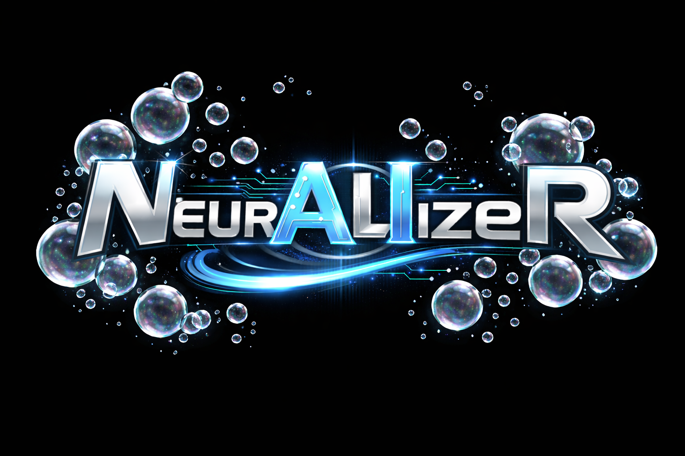

<p align="center">
  
</p>

<h3 align="center">Completely local prompt sanitizer that anonymizes logs and commands for safe LLM ingestion.</h3>

---

## About

NeurALIzer strips sensitive information from prompts, logs, and shell commands before they reach an LLM — so you can feed real operational data into AI workflows without leaking secrets.

**How it works:** A local LLM (Qwen3-4B via llama.cpp) analyzes your input to identify sensitive content. An MCP server then scrubs detected items, replacing them with safe placeholders. Your data never leaves your machine.

## How It Works

```
┌─────────────────────────────────────────────────────────────────────────────────────────┐
│                                   YOUR LOCAL MACHINE                                    │
│                                                                                         │
│  SCRUBBING MODE                                                                         │
│  ┌───────────────────────────────────┐    ┌────────────────────────────────────────────┐│
│  │       Sanitized Panel             │    │            Chat Interface                  ││
│  │                                   │    │                                            ││
│  │                                   │◀───┼───  User types prompt                      ││
│  │   Local LLM (analyze)             │    │                                            ││
│  │        │                          │    │                                            ││
│  │        ├── sensitive ──▶ MCP ─────┼───▶│   Status: "X items scrubbed"               ││
│  │        │                (scrub)   │    │                                            ││
│  │        └── clean ─────────────────┼───▶│   Status: "Clean, no sensitive data"       ││
│  │                                   │    │                                            ││
│  │   Shows detection result          │    │                                            ││
│  └───────────────────────────────────┘    └────────────────────────────────────────────┘│
│                                                                                         │
│  FREE CHAT MODE                                                                         │
│  ┌─────────────────────────────────────────────────────────────────────────────────┐   │
│  │                           Chat Interface (full width)                           │   │
│  │                                                                                 │   │
│  │       User types prompt ───▶ Local LLM (llama.cpp) responds                     │   │
│  │                                                                                 │   │
│  │                      Direct conversation, no analysis                           │   │
│  └─────────────────────────────────────────────────────────────────────────────────┘   │
│                                                                                         │
└─────────────────────────────────────────────────────────────────────────────────────────┘
```

## Requirements

- **GPU (recommended):** 8 GB VRAM — NVIDIA (CUDA) or AMD/Intel (Vulkan)
- **CPU-only:** Works but slower; uses system RAM instead
- **Disk:** ~5 GB for the model file
- **Docker** and **Docker Compose**

## What It Detects

- **PII** — names, emails, phone numbers, addresses
- **Terminal output** — usernames from `whoami`, home directory paths, shell prompts
- **Credentials** — API keys, tokens, passwords, connection strings
- **Log files** — server logs with IPs, timestamps, usernames, endpoints
- **Code secrets** — hardcoded credentials, .env contents
- **Infrastructure** — internal URLs, cloud resource IDs, network details

## Features

**Scrubbing Mode** — Paste prompts or logs into the chat. NeurALIzer detects sensitive content and replaces it with safe placeholders before the LLM sees it.

**Free Chat Mode** — Toggle scrubbing off when you want a normal conversation without interception.

**File Upload** — Upload large log files (up to 2MB) that can't be pasted. Download the sanitized result.

## Getting Started

See the [Setup Guide](docs/setup.md) for installation steps.

## Status

This project is in early development. Check back soon.

## License

Distributed under the MIT License. See [LICENSE](LICENSE) for details.
